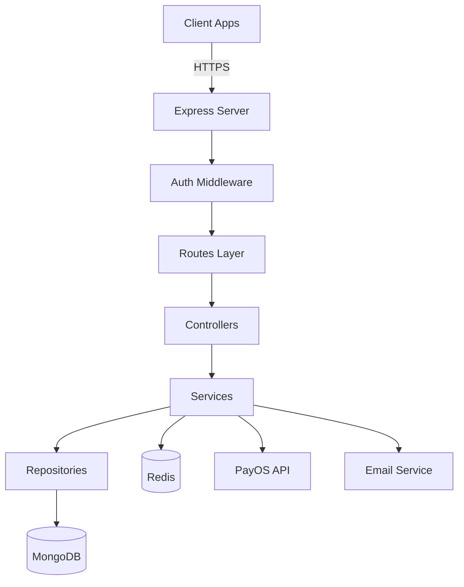

<div align="center">

# 🛍️ Digital E-Commerce Backend

**Enterprise-grade REST API for modern e-commerce platforms**

[](https://github.com/devnguyen0111/Digital-Ecommerce-BE)
[](https://nodejs.org/)
[](LICENSE)
[](https://www.mongodb.com/)
[](docs/CONTRIBUTING.md)

[Features](#-features) • [Quick Start](#-quick-start) • [Documentation](#-documentation) • [API Reference](#-api-reference) • [Contributing](#-contributing)

</div>

---

## 📖 Overview

Digital E-Commerce Backend is a **production-ready**, **scalable**, and **secure** REST API built with **Node.js**, **Express**, and **MongoDB**. It provides comprehensive features for user management, payment processing, digital wallets, and multi-language support.

### 🎯 Key Capabilities

- 🔐 **JWT Authentication** with refresh token rotation
- 💰 **PayOS Payment Integration** with webhook support
- 💳 **Digital Wallet System** with atomic transactions
- 🌍 **i18n Support** (English, Vietnamese)
- 🛡️ **Enterprise Security** (rate limiting, input validation, CORS, Helmet)
- 📧 **Email Notifications** with template system
- 🏗️ **Clean Architecture** (Repository pattern, service layer)
- 🧪 **Test Coverage** (unit, integration, e2e)

---

## ✨ Features

### Authentication & Authorization

- User registration with email verification
- JWT-based authentication (access + refresh tokens)
- Role-based access control (User, Staff, Manager, Admin)
- Password reset with secure tokens
- Session management

### Payment & Wallet

- PayOS payment gateway integration
- Digital wallet with real-time balance
- Transaction history with audit trail
- Webhook processing for payment updates
- Multi-currency support (VND default)

### User Management

- Profile management with avatar upload
- Email verification workflow
- Password change and recovery
- User preferences and settings
- Activity tracking

### Communication

- Transactional emails (Nodemailer)
- Template-based email system
- Multi-language email support
- Background job processing

### Security

- Rate limiting (100 req/15min per IP)
- Input validation and sanitization
- XSS and SQL injection protection
- CORS configuration
- Secure HTTP headers (Helmet)
- Environment-based configuration

---

## 🚀 Quick Start

### Prerequisites

| Tool     | Version  | Purpose                   |
| -------- | -------- | ------------------------- |
| Node.js  | ≥ 14.0.0 | Runtime                   |
| npm/yarn | Latest   | Package manager           |
| MongoDB  | ≥ 4.4    | Database                  |
| Redis    | ≥ 6.0    | Cache & queues (optional) |

### Installation

```bash
# 1. Clone the repository
git clone https://github.com/devnguyen0111/Digital-Ecommerce-BE.git
cd Digital-Ecommerce-BE

# 2. Install dependencies
npm install

# 3. Configure environment
cp .env.example .env
# Edit .env with your configuration

# 4. Start MongoDB
# Windows: net start MongoDB
# macOS/Linux: mongod

# 5. Start the server
npm run dev # Development with hot reload
npm start   # Production
```

### Verify Installation

```bash
# Health check
curl http://localhost:5000/health

# Expected response:
# {
#   "status": "healthy",
#   "timestamp": "2026-02-07T10:30:00.000Z",
#   "uptime": 125
# }
```

---

## 📚 Documentation

| Document                                         | Description                |
| ------------------------------------------------ | -------------------------- |
| [Architecture](docs/ARCHITECTURE.md)             | System design and patterns |
| [Codebase Overview](docs/CODEBASE_OVERVIEW.md)   | Code organization          |
| [API Reference](docs/API_REFERENCE.md)           | Complete API documentation |
| [Environment Setup](docs/ENVIRONMENT_SETUP.md)   | Configuration guide        |
| [Coding Conventions](docs/CODING_CONVENTIONS.md) | Code standards             |
| [Contributing](docs/CONTRIBUTING.md)             | Contribution guidelines    |
| [Deployment](docs/DEPLOYMENT_GUIDE.md)           | Production deployment      |
| [Folder Structure](docs/FOLDER_STRUCTURE.md)     | Directory organization     |
| [Changelog](docs/CHANGELOG.md)                   | Version history            |

---

## 🏗️ Architecture

### System Overview



### Layer Responsibilities

| Layer            | Purpose                   | Location            |
| ---------------- | ------------------------- | ------------------- |
| **Routes**       | API endpoint definition   | `src/routes/`       |
| **Middleware**   | Auth, validation, logging | `src/middleware/`   |
| **Controllers**  | Request/response handling | `src/controllers/`  |
| **Services**     | Business logic            | `src/services/`     |
| **Repositories** | Data access abstraction   | `src/repositories/` |
| **Models**       | Database schemas          | `src/models/`       |
| **Utils**        | Helper functions          | `src/utils/`        |

---

## 🔌 API Reference

### Base URL

```
Development: http://localhost:5000
Production: https://your-domain.com
```

### Authentication

Include JWT token in requests:

```http
Authorization: Bearer <your_jwt_token>
```

### Example: User Registration

**Request**:

```http
POST /api/auth/register
Content-Type: application/json

{
  "username": "johndoe",
  "email": "john@example.com",
  "password": "SecurePass123!",
  "preferredLanguage": "en"
}
```

**Response**:

```json
{
  "success": true,
  "message": "User registered successfully",
  "data": {
    "user": {
      "id": "507f1f77bcf86cd799439011",
      "username": "johndoe",
      "email": "john@example.com"
    },
    "token": "eyJhbGciOiJIUzI1NiIsInR5cCI6IkpXVCJ9...",
    "refreshToken": "eyJhbGciOiJIUzI1NiIsInR5cCI6IkpXVCJ9..."
  }
}
```

### Endpoints Overview

| Category | Endpoint                | Method | Auth |
| -------- | ----------------------- | ------ | ---- |
| Health   | `/health`               | GET    | ❌   |
| Auth     | `/api/auth/register`    | POST   | ❌   |
| Auth     | `/api/auth/login`       | POST   | ❌   |
| Auth     | `/api/auth/me`          | GET    | ✅   |
| User     | `/api/users/profile`    | GET    | ✅   |
| Wallet   | `/api/wallet`           | GET    | ✅   |
| Wallet   | `/api/wallet/add-funds` | POST   | ✅   |

📖 **Full API Documentation**: [API_REFERENCE.md](docs/API_REFERENCE.md)

---

## 🛡️ Security

### Implemented Measures

- ✅ JWT with refresh token rotation
- ✅ bcrypt password hashing (10 rounds)
- ✅ Rate limiting (100 req/15min)
- ✅ Input validation (express-validator)
- ✅ CORS with origin whitelist
- ✅ Helmet for secure HTTP headers
- ✅ Environment variable protection
- ✅ SQL injection prevention (Mongoose)
- ✅ XSS protection

### Security Best Practices

- Never commit `.env` files
- Use strong JWT secrets (32+ chars)
- Rotate secrets regularly
- Enable HTTPS in production
- Keep dependencies updated
- Run security audits: `npm audit`

---

## 🧪 Testing

```bash
# Run all tests
npm test

# Run with coverage
npm run test:coverage

# Run specific test suite
npm test -- auth.test.js

# Watch mode
npm test -- --watch
```

---

## 🤝 Contributing

We welcome contributions! Please read our [Contributing Guide](docs/CONTRIBUTING.md).

### Quick Contribution Steps

1. Fork the repository
2. Create a feature branch: `git checkout -b feature/amazing-feature`
3. Commit changes: `git commit -m 'feat: add amazing feature'`
4. Push to branch: `git push origin feature/amazing-feature`
5. Open a Pull Request

### Commit Convention

We follow [Conventional Commits](https://www.conventionalcommits.org/):

```
feat: add new feature
fix: fix bug
docs: update documentation
style: format code
refactor: restructure code
test: add tests
chore: maintenance tasks
```

---

## 📄 License

This project is licensed under the **ISC License**.

```
Copyright (c) 2026 devnguyen0111

Permission to use, copy, modify, and/or distribute this software for any
purpose with or without fee is hereby granted, provided that the above
copyright notice and this permission notice appear in all copies.

THE SOFTWARE IS PROVIDED "AS IS" AND THE AUTHOR DISCLAIMS ALL WARRANTIES
WITH REGARD TO THIS SOFTWARE INCLUDING ALL IMPLIED WARRANTIES OF
MERCHANTABILITY AND FITNESS. IN NO EVENT SHALL THE AUTHOR BE LIABLE FOR
ANY SPECIAL, DIRECT, INDIRECT, OR CONSEQUENTIAL DAMAGES OR ANY DAMAGES
WHATSOEVER RESULTING FROM LOSS OF USE, DATA OR PROFITS, WHETHER IN AN
ACTION OF CONTRACT, NEGLIGENCE OR OTHER TORTIOUS ACTION, ARISING OUT OF
OR IN CONNECTION WITH THE USE OR PERFORMANCE OF THIS SOFTWARE.
```

---

## 🗺️ Roadmap

### v0.3.0 (Q2 2026)

- [ ] GraphQL API support
- [ ] WebSocket for real-time updates
- [ ] Redis caching layer
- [ ] Elasticsearch integration
- [ ] Unit & integration tests (Jest)
- [ ] CI/CD with GitHub Actions

### v0.4.0 (Q3 2026)

- [ ] Microservices architecture
- [ ] Message queue (RabbitMQ/Kafka)
- [ ] Advanced analytics
- [ ] Multi-vendor support
- [ ] Inventory management
- [ ] Order tracking system

### v0.5.0 (Q4 2026)

- [ ] Mobile app optimization
- [ ] Social authentication
- [ ] AI-powered recommendations
- [ ] Fraud detection
- [ ] Blockchain payments

---

## 🙏 Acknowledgments

Built with amazing open-source technologies:

- [Express.js](https://expressjs.com/) - Web framework
- [MongoDB](https://www.mongodb.com/) - Database
- [Mongoose](https://mongoosejs.com/) - ODM
- [JWT](https://jwt.io/) - Authentication
- [Nodemailer](https://nodemailer.com/) - Email
- [PayOS](https://payos.vn/) - Payment gateway

---

## 📞 Support

- 📖 **Documentation**: [/docs](/docs)
- 🐛 **Issues**: [GitHub Issues](https://github.com/devnguyen0111/Digital-Ecommerce-BE/issues)
- 💬 **Discussions**: [GitHub Discussions](https://github.com/devnguyen0111/Digital-Ecommerce-BE/discussions)

### Connect

**devnguyen0111**

- GitHub: [@devnguyen0111](https://github.com/devnguyen0111)
- Repository: [Digital-Ecommerce-BE](https://github.com/devnguyen0111/Digital-Ecommerce-BE)

---

<div align="center">
  <p>Made with ❤️ by <strong>devnguyen0111</strong></p>
  <p>⭐ Star this repo if you find it helpful!</p>
  
  **[Back to Top](#-digital-e-commerce-backend)**
</div>
