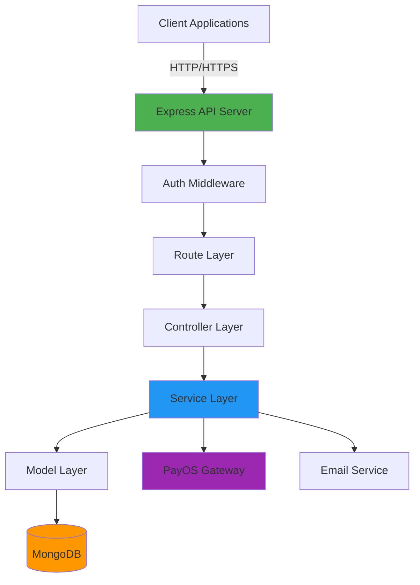
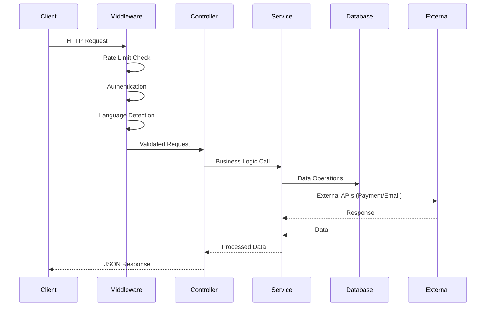

<div align="center">
  <h1>🛍️ Digital E-Commerce Backend</h1>
  <p><strong>Enterprise-grade API platform for modern e-commerce applications</strong></p>
  
  [](https://github.com/devnguyen0111/Digital-Ecommerce-BE)
  [](https://nodejs.org/)
  [](LICENSE)
  [](https://www.mongodb.com/)
  
  <p>
    <a href="#key-features">Features</a> •
    <a href="#architecture">Architecture</a> •
    <a href="#quick-start">Quick Start</a> •
    <a href="#api-documentation">API Docs</a> •
    <a href="#contributing">Contributing</a>
  </p>
</div>

---

## 📖 Introduction

**Digital E-Commerce Backend** is a production-ready, scalable REST API designed to power modern e-commerce platforms. Built with Node.js, Express, and MongoDB, it provides a comprehensive suite of features including user authentication, payment processing, digital wallet management, multi-language support, and robust security measures.

This backend is architected following industry best practices, featuring:

- **Microservice-ready design** with modular service layers
- **Enterprise-grade security** with JWT, rate limiting, and validation
- **International support** with built-in i18n for English and Vietnamese
- **Production-optimized** with error handling, logging, and monitoring

Whether you're building a marketplace, digital goods platform, or traditional e-commerce store, this backend provides the foundation you need to scale.

---

## ✨ Key Features

### 🔐 Authentication & Security

- **JWT-based authentication** with access and refresh token strategy
- **Role-based access control (RBAC)** for multi-level permissions
- **Password hashing** with bcrypt for secure credential storage
- **Rate limiting** to prevent abuse (100 requests/15min per IP)
- **CORS & Helmet** for cross-origin security and HTTP header protection
- **Input validation** using express-validator

### 💰 Payment & Wallet System

- **PayOS integration** for seamless payment processing
- **Digital wallet** with real-time balance tracking
- **Transaction history** with detailed audit trails
- **Webhook support** for payment notifications
- **Multi-currency support** (VND default, extensible)
- **Atomic transactions** for financial consistency

### 🌍 Internationalization (i18n)

- **Multi-language support** (English, Vietnamese)
- **Dynamic language switching** via query params, headers, or user preferences
- **Localized error messages** and API responses
- **Easy extensibility** for additional languages

### 👤 User Management

- **Complete user lifecycle** (registration, login, profile management)
- **Email verification** with automated workflows
- **Password reset** functionality
- **User preferences** and profile customization
- **Account activity tracking**

### 📦 Product & Order Management

- **Full CRUD operations** for products
- **Product reviews & ratings**
- **Order lifecycle management**
- **Inventory tracking**
- **Coupon & discount system**

### 📧 Communication & Notifications

- **Email service** powered by Nodemailer
- **Transactional emails** (verification, password reset, receipts)
- **Template-based email system**
- **SMTP configuration** for any provider

### 📁 File Management

- **Image upload** with Multer
- **Image processing** and optimization with Sharp
- **Secure file storage**
- **Multiple format support**

### 🛠️ Developer Experience

- **Comprehensive error handling** with meaningful messages
- **Request logging** with Morgan
- **Hot reload** in development with Nodemon
- **Environment-based configuration**
- **Detailed API documentation** (see [api-endpoints.json](api-endpoints.json))

---

## 🏗️ Architecture

### System Overview



### Request Flow



### Layer Architecture

| Layer           | Responsibility                                | Location           |
| --------------- | --------------------------------------------- | ------------------ |
| **Routes**      | API endpoint definition, request routing      | `src/routes/`      |
| **Middleware**  | Auth, validation, error handling, i18n        | `src/middleware/`  |
| **Controllers** | Request/response handling, orchestration      | `src/controllers/` |
| **Services**    | Business logic, external integrations         | `src/services/`    |
| **Models**      | Data schema, validation, database interaction | `src/models/`      |
| **Utils**       | Helper functions, shared utilities            | `src/utils/`       |
| **Config**      | Configuration, environment, constants         | `src/config/`      |

---

## 🚀 Quick Start

### Prerequisites

Ensure you have the following installed on your system:

| Tool                | Version  | Purpose             |
| ------------------- | -------- | ------------------- |
| **Node.js**         | ≥ 14.0.0 | Runtime environment |
| **npm** or **yarn** | Latest   | Package management  |
| **MongoDB**         | ≥ 4.4    | Database            |
| **Git**             | Latest   | Version control     |

### Installation

**1. Clone the repository**

```bash
git clone https://github.com/devnguyen0111/Digital-Ecommerce-BE.git
cd Digital-Ecommerce-BE
```

**2. Install dependencies**

```bash
npm install
```

**3. Configure environment variables**

Create a `.env` file in the root directory (see [Environment Configuration](#environment-configuration) for details):

```bash
# Copy from example
cp .env.example .env

# Edit with your configuration
nano .env  # or use your preferred editor
```

**4. Set up MongoDB**

Ensure MongoDB is running locally:

```bash
# Windows (if using MongoDB Community)
net start MongoDB

# macOS/Linux
mongod --dbpath /path/to/your/data
```

Or use MongoDB Atlas for cloud hosting.

---

## 🎮 Running the Project

### Development Mode

Start the server with hot reload enabled:

```bash
npm run dev
```

The API will be available at `http://localhost:5000` (or your configured port).

**Development features:**

- Auto-restart on file changes
- Detailed error messages
- Request logging to console
- Source maps enabled

### Production Mode

Start the optimized production server:

```bash
npm start
```

**Production features:**

- Optimized error messages (no stack traces exposed)
- Production-grade logging
- Performance optimizations

### Verify Installation

Test the server is running:

```bash
# Health check
curl http://localhost:5000/health

# API info
curl http://localhost:5000/api
```

Expected response:

```json
{
  "status": "ok",
  "timestamp": "2026-02-07T10:30:00.000Z",
  "uptime": 125.234
}
```

---

## ⚙️ Environment Configuration

### Required Variables

Create a `.env` file with the following configuration:

```env
# ======================
# Server Configuration
# ======================
NODE_ENV=development          # Environment: development | production | test
PORT=5000                     # Server port

# ======================
# Database Configuration
# ======================
MONGODB_URI=mongodb://localhost:27017/dn-ecommerce
# For MongoDB Atlas:
# MONGODB_URI=mongodb+srv://<username>:<password>@cluster.mongodb.net/dn-ecommerce

# ======================
# JWT Configuration
# ======================
JWT_SECRET=your_super_secret_jwt_key_change_this_in_production
JWT_EXPIRE=7d                 # Access token expiration
JWT_REFRESH_SECRET=your_refresh_token_secret_change_this_in_production
JWT_REFRESH_EXPIRE=30d        # Refresh token expiration

# ======================
# PayOS Configuration
# ======================
PAYOS_CLIENT_ID=your_payos_client_id
PAYOS_API_KEY=your_payos_api_key
PAYOS_CHECKSUM_KEY=your_payos_checksum_key
PAYOS_RETURN_URL=http://localhost:3000/payment/success
PAYOS_CANCEL_URL=http://localhost:3000/payment/cancel

# ======================
# Email Configuration
# ======================
EMAIL_HOST=smtp.gmail.com
EMAIL_PORT=587
EMAIL_USER=your_email@gmail.com
EMAIL_PASSWORD=your_app_password    # Use App Password for Gmail
EMAIL_FROM=DN-Ecommerce <noreply@dn-ecommerce.com>

# ======================
# Frontend Configuration
# ======================
FRONTEND_URL=http://localhost:3000

# ======================
# Wallet Configuration
# ======================
DEFAULT_CURRENCY=VND

# ======================
# Internationalization
# ======================
DEFAULT_LANGUAGE=en           # Default language: en | vi
SUPPORTED_LANGUAGES=en,vi     # Comma-separated list
```

### Email Setup (Gmail Example)

To use Gmail for sending emails:

1. Enable 2-Factor Authentication on your Google account
2. Generate an App Password:
   - Go to Google Account → Security → 2-Step Verification → App passwords
   - Generate a password for "Mail"
3. Use the generated password in `EMAIL_PASSWORD`

### Security Best Practices

⚠️ **Important**: Never commit `.env` files to version control!

- Use strong, randomly generated secrets for JWT tokens
- Rotate secrets regularly in production
- Use different secrets for different environments
- Store production secrets in secure vaults (AWS Secrets Manager, Azure Key Vault, etc.)

---

## 📁 Folder Structure

```
Digital-Ecommerce-BE/
├── 📄 server.js                    # Application entry point
├── 📄 package.json                 # Project dependencies and scripts
├── 📄 api-endpoints.json           # Complete API documentation
├── 📄 test-webhook.js              # Webhook testing utility
├── 📄 .env.example                 # Environment variables template
├── 📄 .gitignore                   # Git ignore rules
│
├── 📁 locales/                     # Internationalization
│   ├── en.json                     # English translations
│   └── vi.json                     # Vietnamese translations
│
└── 📁 src/                         # Source code
    │
    ├── 📁 config/                  # Configuration
    │   ├── constants.js            # Application constants
    │   ├── database.js             # MongoDB connection setup
    │   ├── env.js                  # Environment variable management
    │   ├── i18n.js                 # i18n configuration
    │   └── validateEnv.js          # Environment validation
    │
    ├── 📁 controllers/             # Request handlers
    │   ├── 📁 product/             # Product controllers
    │   └── 📁 user/
    │       ├── authController.js   # Authentication logic
    │       ├── userController.js   # User management
    │       └── walletController.js # Wallet operations
    │
    ├── 📁 middleware/              # Custom middleware
    │   ├── auth.js                 # JWT authentication
    │   ├── errorHandler.js         # Global error handler
    │   ├── language.js             # Language detection
    │   └── validators.js           # Input validation
    │
    ├── 📁 models/                  # Database schemas
    │   ├── Payment.js              # Payment model
    │   ├── User.js                 # User model
    │   ├── Wallet.js               # Wallet model
    │   └── WalletTransaction.js    # Transaction model
    │
    ├── 📁 routes/                  # API routes
    │   ├── index.js                # Main router
    │   └── 📁 user/
    │       ├── authRoutes.js       # Auth endpoints
    │       ├── userRoutes.js       # User endpoints
    │       └── walletRoutes.js     # Wallet endpoints
    │
    ├── 📁 services/                # Business logic
    │   ├── emailService.js         # Email operations
    │   ├── paymentService.js       # PayOS integration
    │   └── walletService.js        # Wallet business logic
    │
    └── 📁 utils/                   # Utilities
        ├── apiFeatures.js          # Query helpers (pagination, filtering)
        ├── apiResponse.js          # Response formatters
        ├── asyncHandler.js         # Async error wrapper
        └── logger.js               # Logging utility
```

### Key Files Explained

| File                               | Purpose                                                     |
| ---------------------------------- | ----------------------------------------------------------- |
| **server.js**                      | Initializes Express app, connects middleware, starts server |
| **api-endpoints.json**             | Complete API documentation with examples                    |
| **src/config/validateEnv.js**      | Validates required environment variables on startup         |
| **src/middleware/errorHandler.js** | Centralized error handling with localized messages          |
| **src/utils/asyncHandler.js**      | Wraps async functions to catch errors automatically         |

---

## 📚 API Documentation

### Base URL

```
Development: http://localhost:5000
Production: https://your-domain.com
```

### Authentication

Most endpoints require authentication. Include the JWT token in the Authorization header:

```http
Authorization: Bearer <your_jwt_token>
```

### API Endpoints Overview

| Category   | Endpoint                   | Method | Auth Required |
| ---------- | -------------------------- | ------ | ------------- |
| **Health** | `/health`                  | GET    | ❌            |
| **Auth**   | `/api/auth/register`       | POST   | ❌            |
| **Auth**   | `/api/auth/login`          | POST   | ❌            |
| **Auth**   | `/api/auth/me`             | GET    | ✅            |
| **Auth**   | `/api/auth/refresh`        | POST   | ❌            |
| **User**   | `/api/users/profile`       | GET    | ✅            |
| **User**   | `/api/users/profile`       | PUT    | ✅            |
| **Wallet** | `/api/wallet`              | GET    | ✅            |
| **Wallet** | `/api/wallet/deposit`      | POST   | ✅            |
| **Wallet** | `/api/wallet/transactions` | GET    | ✅            |

### Example: User Registration

**Request:**

```http
POST /api/auth/register
Content-Type: application/json

{
  "username": "johndoe",
  "email": "john@example.com",
  "password": "SecurePass123!",
  "preferredLanguage": "en"
}
```

**Response:**

```json
{
  "success": true,
  "message": "User registered successfully",
  "data": {
    "user": {
      "id": "507f1f77bcf86cd799439011",
      "username": "johndoe",
      "email": "john@example.com",
      "isVerified": false
    },
    "token": "eyJhbGciOiJIUzI1NiIsInR5cCI6IkpXVCJ9...",
    "refreshToken": "eyJhbGciOiJIUzI1NiIsInR5cCI6IkpXVCJ9..."
  }
}
```

### Example: Language Support

Include language preference in any request:

```http
GET /api/users/profile?lang=vi
# OR
GET /api/users/profile
Accept-Language: vi
```

For complete API documentation with all endpoints, see [api-endpoints.json](api-endpoints.json).

---

## 🛡️ Security Features

### Implemented Security Measures

| Feature              | Implementation      | Configuration           |
| -------------------- | ------------------- | ----------------------- |
| **Rate Limiting**    | express-rate-limit  | 100 req/15min per IP    |
| **CORS**             | cors middleware     | Configured whitelist    |
| **HTTP Headers**     | Helmet              | Security headers        |
| **Input Validation** | express-validator   | Schema-based validation |
| **Authentication**   | JWT                 | Access + Refresh tokens |
| **Password Hashing** | bcryptjs            | Salt rounds: 10         |
| **SQL Injection**    | Mongoose            | Built-in protection     |
| **XSS Protection**   | Helmet + Validation | Content sanitization    |

### Best Practices Applied

- ✅ Environment variables for secrets
- ✅ No sensitive data in logs
- ✅ HTTPS enforced in production
- ✅ JWT token expiration
- ✅ Refresh token rotation
- ✅ Password strength requirements
- ✅ Email verification for new accounts

---

## 🤝 Contributing

We welcome contributions from the community! Here's how you can help:

### Development Workflow

**1. Fork & Clone**

```bash
# Fork the repository on GitHub
# Then clone your fork
git clone https://github.com/YOUR_USERNAME/Digital-Ecommerce-BE.git
cd Digital-Ecommerce-BE
```

**2. Create a Branch**

```bash
# Create a feature branch
git checkout -b feature/amazing-feature

# Or a bugfix branch
git checkout -b fix/bug-description
```

**3. Make Your Changes**

- Write clean, maintainable code
- Follow existing code style
- Add comments for complex logic
- Update documentation if needed

**4. Test Your Changes**

```bash
# Start the server
npm run dev

# Test your endpoints manually or with Postman
# Ensure no existing functionality is broken
```

**5. Commit Your Changes**

```bash
git add .
git commit -m "feat: add amazing feature"

# Follow conventional commit format:
# feat: new feature
# fix: bug fix
# docs: documentation changes
# style: formatting, missing semicolons, etc.
# refactor: code restructuring
# test: adding tests
# chore: maintenance tasks
```

**6. Push & Create Pull Request**

```bash
git push origin feature/amazing-feature
```

Then open a Pull Request on GitHub with:

- Clear description of changes
- Screenshots (if UI-related)
- Related issue numbers

### Code Style Guidelines

- Use **meaningful variable names**
- Follow **ESLint** rules (if configured)
- Keep functions **small and focused**
- Add **JSDoc comments** for public functions
- Use **async/await** instead of callbacks
- Handle **errors properly**

### What to Contribute

- 🐛 **Bug fixes**
- ✨ **New features**
- 📝 **Documentation improvements**
- 🎨 **Code refactoring**
- 🧪 **Tests** (highly appreciated!)
- 🌍 **Translations** (add new languages)

### Reporting Issues

Found a bug? Have a suggestion?

1. Check existing issues first
2. Create a new issue with:
   - Clear title
   - Detailed description
   - Steps to reproduce (for bugs)
   - Expected vs actual behavior
   - Environment details (OS, Node version, etc.)

---

## 📄 License

This project is licensed under the **ISC License**.

```
Copyright (c) 2026 devnguyen0111

Permission to use, copy, modify, and/or distribute this software for any
purpose with or without fee is hereby granted, provided that the above
copyright notice and this permission notice appear in all copies.

THE SOFTWARE IS PROVIDED "AS IS" AND THE AUTHOR DISCLAIMS ALL WARRANTIES
WITH REGARD TO THIS SOFTWARE INCLUDING ALL IMPLIED WARRANTIES OF
MERCHANTABILITY AND FITNESS. IN NO EVENT SHALL THE AUTHOR BE LIABLE FOR
ANY SPECIAL, DIRECT, INDIRECT, OR CONSEQUENTIAL DAMAGES OR ANY DAMAGES
WHATSOEVER RESULTING FROM LOSS OF USE, DATA OR PROFITS, WHETHER IN AN
ACTION OF CONTRACT, NEGLIGENCE OR OTHER TORTIOUS ACTION, ARISING OUT OF
OR IN CONNECTION WITH THE USE OR PERFORMANCE OF THIS SOFTWARE.
```

---

## 🗺️ Roadmap

### Version 0.3.0 (Q2 2026)

- [ ] **GraphQL API** support alongside REST
- [ ] **WebSocket** integration for real-time updates
- [ ] **Redis caching** for improved performance
- [ ] **Elasticsearch** for advanced product search
- [ ] **Unit & Integration tests** with Jest
- [ ] **API rate limiting per user** (not just IP)

### Version 0.4.0 (Q3 2026)

- [ ] **Microservices architecture** refactoring
- [ ] **Message queue** (RabbitMQ/Kafka) for async tasks
- [ ] **Advanced analytics** dashboard
- [ ] **Multi-vendor support**
- [ ] **Inventory management** system
- [ ] **Order tracking** with status updates

### Version 0.5.0 (Q4 2026)

- [ ] **Mobile app backend** optimization
- [ ] **Social authentication** (Google, Facebook, Apple)
- [ ] **AI-powered recommendations**
- [ ] **Advanced fraud detection**
- [ ] **Multi-warehouse** support
- [ ] **Blockchain payment** integration

### Future Considerations

- Cloud deployment automation (AWS/GCP/Azure)
- Kubernetes orchestration
- CI/CD pipeline with GitHub Actions
- Performance monitoring (New Relic, Datadog)
- A/B testing framework
- Admin dashboard API
- Customer support ticket system
- Loyalty/rewards program API

---

## 🙏 Acknowledgments

This project is built with amazing open-source technologies:

- **[Express.js](https://expressjs.com/)** - Fast, unopinionated web framework
- **[MongoDB](https://www.mongodb.com/)** - Flexible NoSQL database
- **[Mongoose](https://mongoosejs.com/)** - Elegant MongoDB object modeling
- **[JWT](https://jwt.io/)** - Secure authentication standard
- **[Nodemailer](https://nodemailer.com/)** - Email sending made easy
- **[PayOS](https://payos.vn/)** - Vietnamese payment gateway

Special thanks to the open-source community for continuous inspiration and support.

---

## 📞 Support & Contact

### Get Help

- 📖 **Documentation**: [api-endpoints.json](api-endpoints.json)
- 🐛 **Issues**: [GitHub Issues](https://github.com/devnguyen0111/Digital-Ecommerce-BE/issues)
- 💬 **Discussions**: [GitHub Discussions](https://github.com/devnguyen0111/Digital-Ecommerce-BE/discussions)

### Connect with the Author

**devnguyen0111**

- 🐙 GitHub: [@devnguyen0111](https://github.com/devnguyen0111)
- 📦 Repository: [Digital-Ecommerce-BE](https://github.com/devnguyen0111/Digital-Ecommerce-BE)

---

<div align="center">
  <p>Made with ❤️ by <strong>devnguyen0111</strong></p>
  <p>
    <sub>⭐ Star this repo if you find it helpful!</sub>
  </p>
  
  **[Back to Top](#-digital-e-commerce-backend)**
</div>
